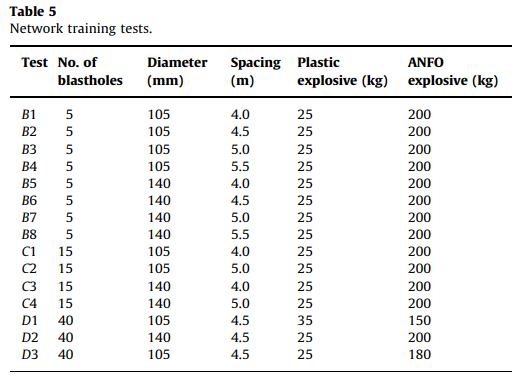

# Description

A.E. Álvarez-Vigil et al, [Predicting blasting propagation velocity and vibration frequency using neural network](https://doi.org/10.1016/j.ijrmms.2012.05.002)

The growth in open-pit mining ,motivated by a growing demand for minerals ,has
led to considerable increase in the use of explosives for blasting purposes.
Explosives are an efficient source of energy for breaking up and excavating
rock. An explosive detonoted inside a blasthole immediately releases a massive
amount of energy in the form of pressure and temperature.
In fact only small proportion of explosive energy is used to break up the rock
mass ; most energy is dissipated in producing non-desirable effects such as
vibrations,noise,fly rock,air blast,etc.(A.E. Álvarez-Vigil et al, 2012)

In this paper authors try to predict the **Frequency(F)** and the **Peak
Particle velocity (PPV)**, two paramaters most widely used to measure
ground vibration wich is,a non-desirable , undualting movement propagated
from the detonation point,similar to the ripple effect produced 
by a stone thrown into a pond.The shock wave passing through structures
located on the ground surface transmits vibration to these structure that
makes them resonate if the vibration frequency of the terrain coincides 
with the natural frequency of the structure.Cousequently the amplitude of
the vibration may grow to become larger than the inducing vibration.(A.E. Álvarez-Vigil et al, 2012)

# Dataset

due to the unavailability of the original dataset use in this paper ,  I use a synthetic dataset generated from sample point provided by the authors

The dataset is dived into training set(70%),a validation set (30%) and testing
set (10%)

# Experimentation and Result
The model is train for 100 epochs with an early stopper of patience 10. 
After the trainning we got a MSE of 1.14 for the class PPV and a MSE of 2.57
for the class frequency(performances are mesured on the testset).
 

